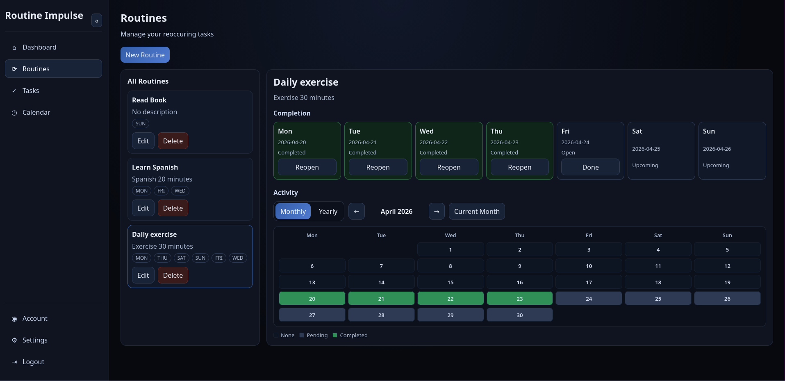

<div align="center">


<hr>

### Build routines with simple daily impulses.

Routine Impulse is a habit and task tracking app.
It helps users build routines with simple daily actions.

[Quick Start](#quick-start) - [Development](#development) - [License](#license)



</div>

> [!NOTE]  
> Routine Impulse is work in progress

## Quick Start

Build and run Routine Impulse locally with Docker.

### Prerequisites
- Docker & Docker Compose
- Java 21 (for local backend development)
- Node.js and npm (for local frontend development)

### Clone Repository
```bash
git clone https://github.com/khde/routine-impulse
```

```bash
cd routine-impulse
```

### Build Docker Image
```bash
docker build -t routine-impulse .
```

### Configure
1. Copy the environment template:
```bash
cp .env.template .env
```
2. Configure the `.env` file with database settings and JWT key paths.

3. Generate JWT keys:
These commands create a private/public key pair in `.secrets/jwt`.

```bash
mkdir -p .secrets/jwt
openssl genpkey -algorithm RSA -pkeyopt rsa_keygen_bits:2048 -out .secrets/jwt/privateKey.pem
openssl rsa -pubout -in .secrets/jwt/privateKey.pem -out .secrets/jwt/publicKey.pem
```

### Run with Docker Compose
```bash
docker compose up
```

With the default Docker Compose setup, Routine Impulse is available on port 8080.
Access it at `http://localhost:8080`.

## Development

Backend and frontend are in separate folders:

- `backend/` (Quarkus)
- `frontend/` (React)

### Start for development

Run both services in separate terminals.

Backend:
```bash
cd backend
./mvnw quarkus:dev
```

Place `.env` in `backend/`.
Place JWT keys in `backend/src/main/resources/jwt`.

Frontend:
```bash
cd frontend
npm install
npm run dev
```

## License
This project is licensed under the Apache License 2.0.
See [LICENSE](./LICENSE) for details.